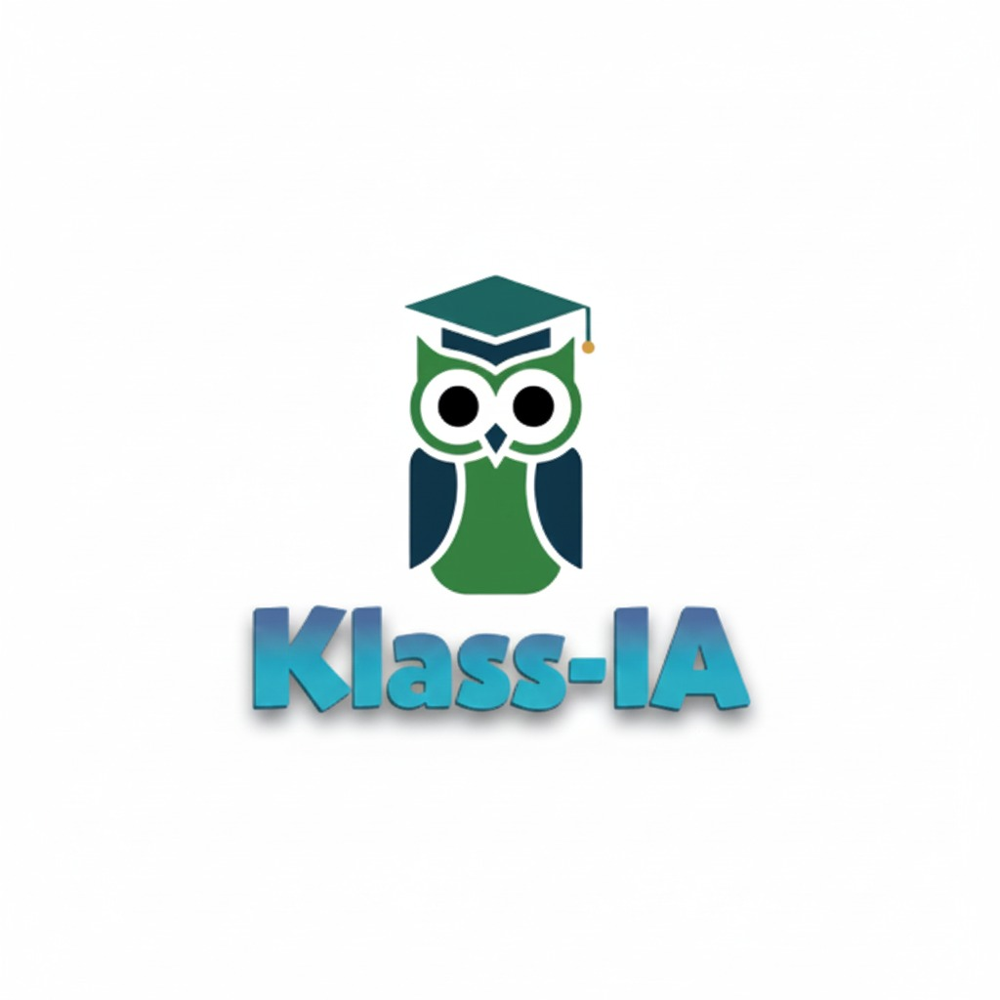

# Klass-IA Frontend

Interfaz web desarrollada en React para la plataforma educativa **Klass-IA**, un entorno donde estudiantes y docentes acceden a asistentes con IA para planificar estudios, generar exámenes, participar en foros y gestionar perfiles académicos.  
El proyecto mantiene la identidad gráfica de Klass-IA / Keralty e integra componentes personalizables para desplegarse en entornos web modernos.



## Tabla de contenidos
1. [Características principales](#características-principales)  
2. [Stack tecnológico](#stack-tecnológico)  
3. [Requisitos previos](#requisitos-previos)  
4. [Instalación](#instalación)  
5. [Scripts disponibles](#scripts-disponibles)  
6. [Estructura del directorio](#estructura-del-directorio)  
7. [Integración con el backend](#integración-con-el-backend)  
8. [Convenciones de estilo](#convenciones-de-estilo)  
9. [Contribuciones](#contribuciones)  
10. [Licencia](#licencia)

## Características principales
- **Autenticación y perfiles**: formulario de acceso/registro con roles de estudiante o docente, edición de datos y persistencia de sesión en memoria de la app.
- **Asistente de estudiantes**: chatbot, planificador de estudio y foro colaborativo con envío/respuesta de publicaciones.
- **Herramientas docentes**: generador de exámenes/casos/rúbricas impulsado por IA con exportación a PDF.
- **Sección “Qué se puede hacer”**: explica casos de uso y muestra los beneficios de la plataforma.
- **UI responsive**: navegación adaptada para desktop/mobile, menú hamburguesa, footer inteligente y decoraciones animadas.
- **Tematización**: paleta moderna basada en los colores de Klass-IA y Unisanitas con CSS Modules y gradientes personalizados.

## Stack tecnológico
- [React 18](https://react.dev/) + Hooks.
- [CSS Modules](https://github.com/css-modules/css-modules) para estilos locales (`App.module.css`, `Student.module.css`, etc.).
- [React Icons](https://react-icons.github.io/react-icons/) para los íconos (`Fi*`).
- [Axios](https://axios-http.com/) para consumo de la API Klass-IA.
- [jsPDF](https://github.com/parallax/jsPDF) para exportar evaluaciones a PDF.

## Requisitos previos
- Node.js >= 18.x
- npm >= 9.x
- Acceso al backend desplegado en `https://klass-ai.onrender.com` (la URL está hardcodeada en los componentes; ajusta si necesitas otro entorno).

## Instalación
```bash
git clone https://github.com/<tu-usuario>/Klass-AI.git
cd Klass-AI/frontend
npm install
```

## Scripts disponibles
| Comando | Descripción |
|---------|-------------|
| `npm start` | Levanta el servidor de desarrollo en `http://localhost:3000`. |
| `npm run build` | Genera la versión optimizada en `build/`. |
| `npm test` | Ejecuta la suite de tests de CRA (si se agregan). |
| `npm run eject` | Expone la configuración interna de CRA (irreversible). |

## Estructura del directorio
```
frontend/
├── public/               # index.html y assets estáticos
├── src/
│   ├── components/       # AuthForm, StudentAssistant, TeacherGenerator, etc.
│   ├── css/              # CSS Modules (App, Student, Auth, Profile, UI)
│   ├── img/              # Logos Klass-IA, Unisanitas, Keralty
│   ├── App.js            # Router principal y layout
│   └── index.js          # Punto de entrada React
├── package.json
└── README.md             # Este documento
```

## Integración con el backend
Los endpoints consumidos se encuentran en `https://klass-ai.onrender.com`:
- `/login`, `/register`: autenticación.
- `/student`, `/coach`: asistentes para estudiantes.
- `/teacher`: generador para docentes.
- `/forum/*`: endpoints del foro.
- `/profile/update`: actualización de perfil.

Si necesitas apuntar a otro dominio, actualiza las URLs en cada componente relevante (`StudentAssistant.jsx`, `StudyCoach.jsx`, `TeacherGenerator.jsx`, `AuthForm.jsx`, `StudentForum.jsx`, `UserProfile.jsx`).

## Convenciones de estilo
- Paleta definida en `:root` dentro de `App.module.css` y replicada en los demás módulos.
- Uso de `ui.hoverLift`, `ui.fadeIn` y `ui.btnSmooth` para animaciones suaves.
- Componentes escritos en español (textos, labels, mensajes).
- Evitar reemplazar los cambios de diseño ya presentes; añade nuevas variantes en CSS Modules si es necesario.

## Contribuciones
1. Crea un fork y una rama descriptiva: `feat/nueva-funcionalidad`.
2. Asegúrate de ejecutar `npm start` y revisar lints/formatos antes de subir cambios.
3. Envía un PR describiendo el alcance y adjunta capturas si modificas la UI.

## Licencia
Proyecto privado para propósitos académicos dentro de Klass-IA / Unisanitas. Si deseas reutilizarlo fuera del ecosistema, solicita autorización previa.
